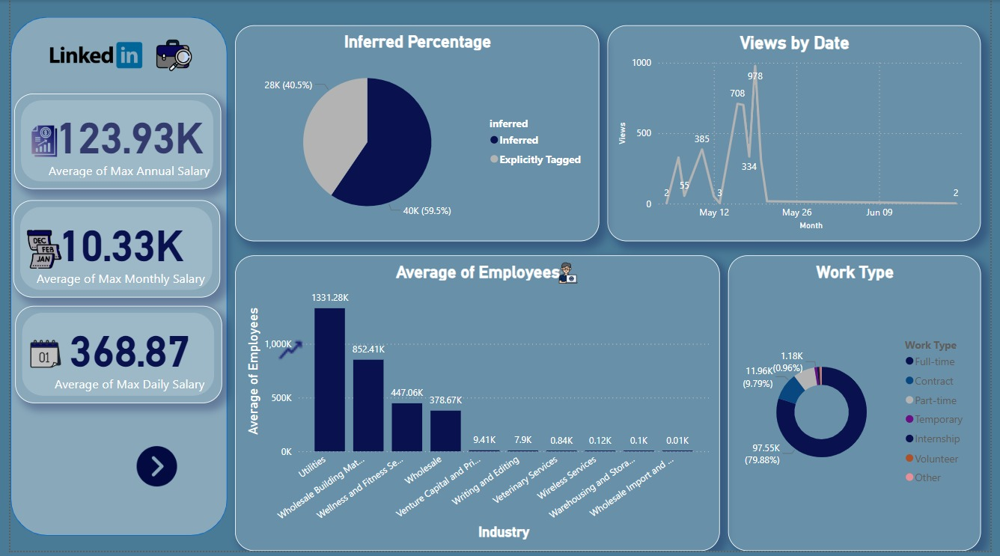
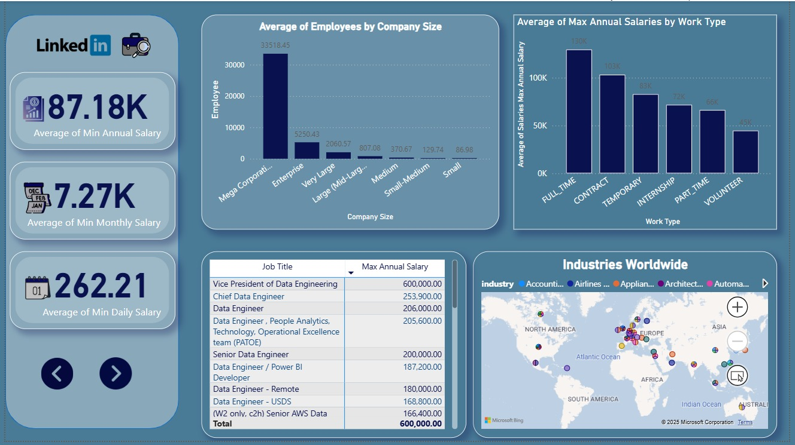
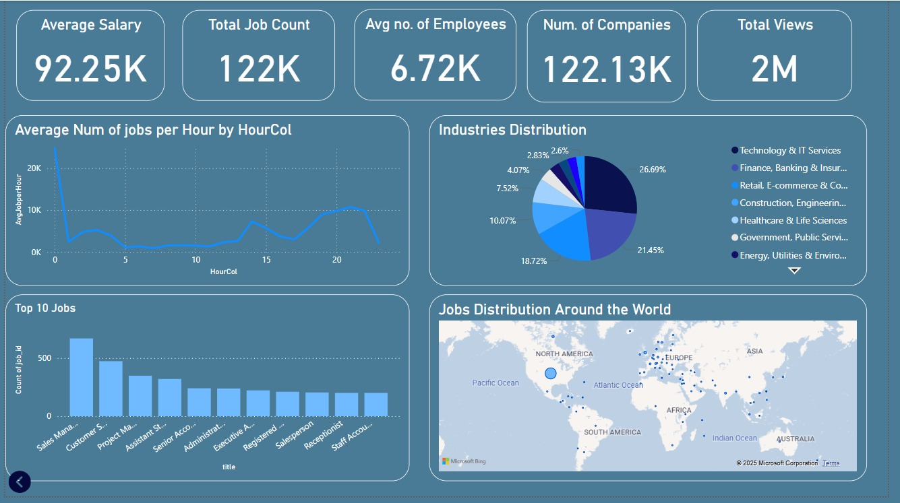

# 📊 LinkedIn Job Postings Dashboard | Power BI Project
Welcome to my Power BI project analyzing LinkedIn job postings using a real-world dataset from Kaggle. This dashboard explores hiring trends, skill demand, job functions, seniority levels, and remote work distribution — providing valuable insights for job seekers, recruiters, and data enthusiasts alike.
---
## 📁 Dataset Information
- **Source**: [LinkedIn Job Postings – Kaggle](https://www.kaggle.com/datasets/arshkon/linkedin-job-postings)
- **Size**: ~200K+ job postings
- **Fields Included**:
- Job Title
- Company Name
- Industry
- Location
- Employment Type
- Experience Level
- Remote Type
- Skills Required
- Posted Date
---
## 📌 Key Features of the Dashboard
✔️ **Top Hiring Companies** 
✔️ **Most In-Demand Skills** 
✔️ **Job Distribution by Country & Location** 
✔️ **Remote vs On-Site Work Trends** 
✔️ **Breakdown by Industry, Employment Type & Seniority Level** 
✔️ **Interactive filters** for exploring specific insights
---
## 📷 Dashboard Preview

  

  

  

---

🔗 [LinkedIn]([https://www.linkedin.com/](https://www.linkedin.com/in/adham-hassan-a26724294/)) | ✉️ [Email Me](adhamhassanali001@gmail.com)
---
## ⭐ Support
If you found this project helpful, feel free to give it a ⭐ and share it with others!
LinkedIn-Job-Posting-Analysis
